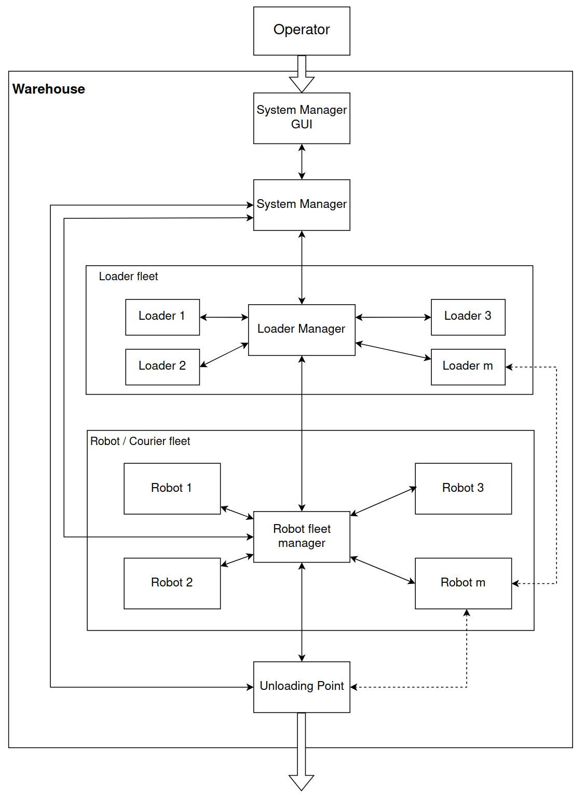
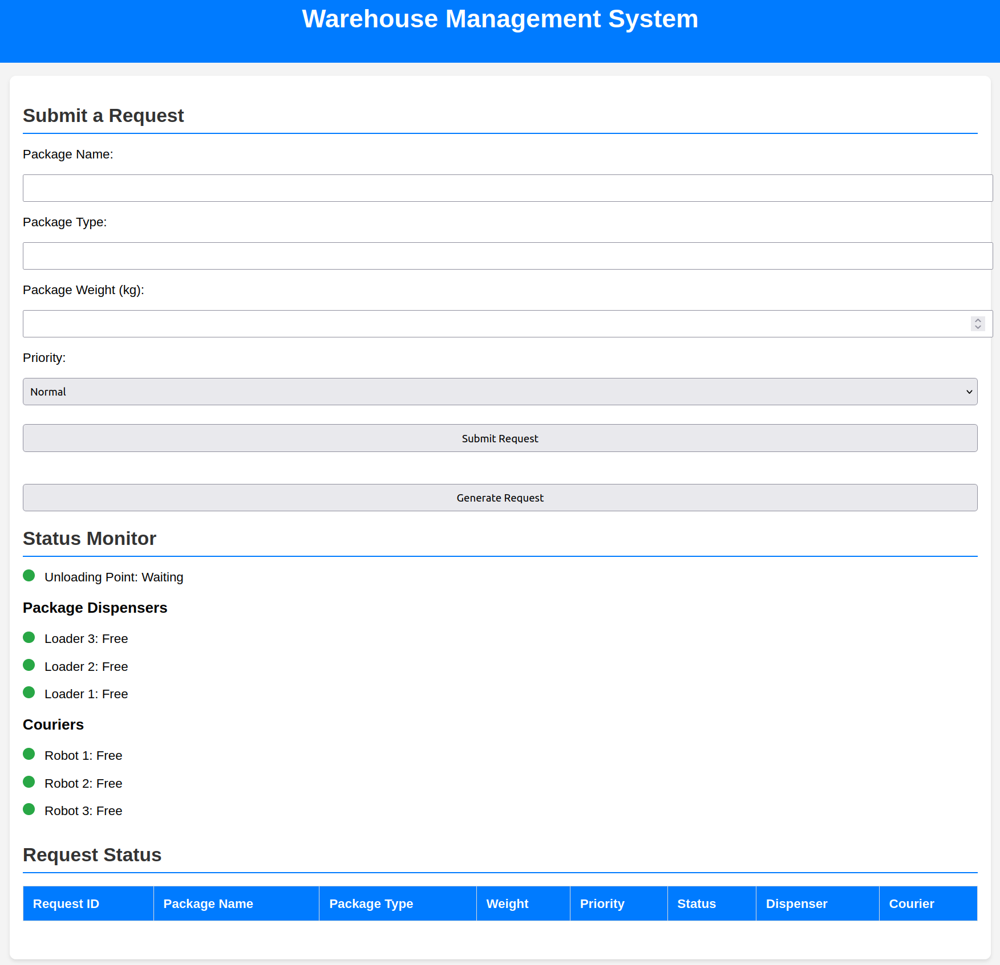
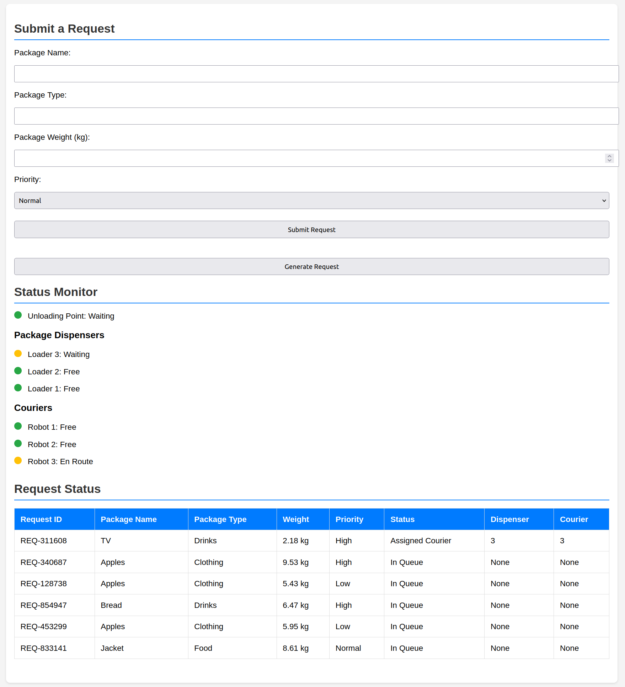
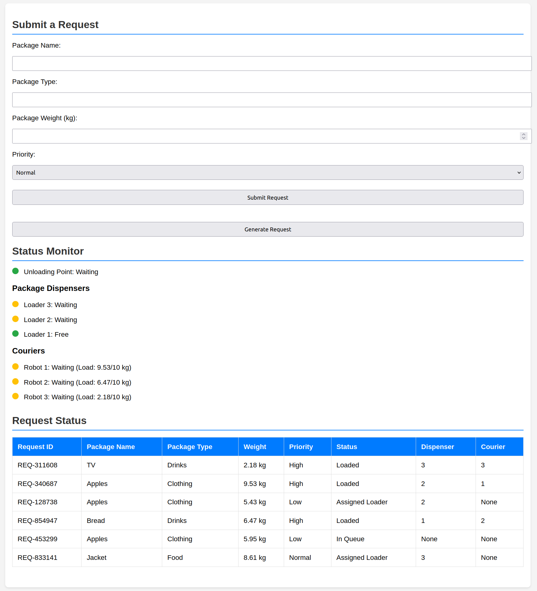
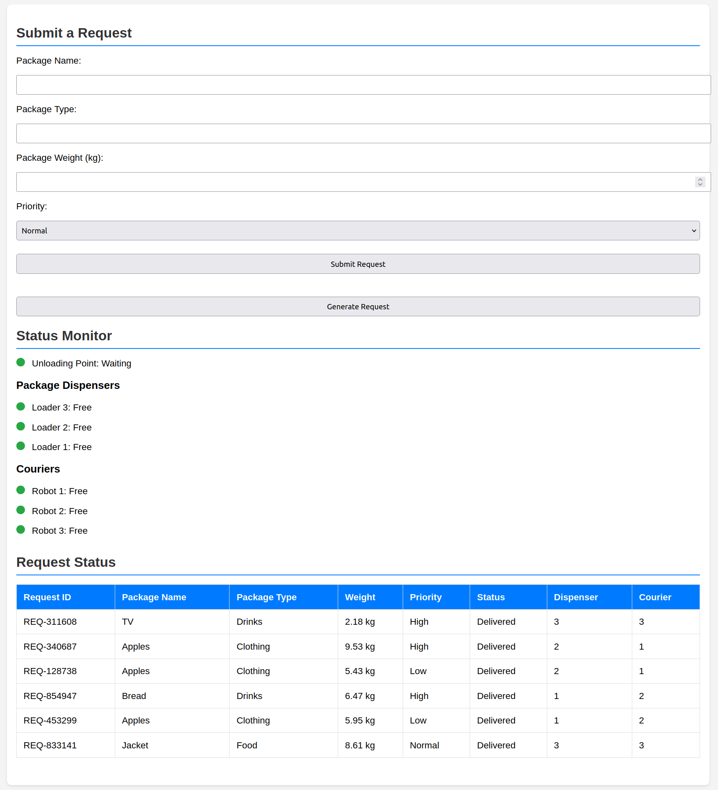

# MAS warehouse system

This is a study project in course Multi Agent Systems.

Developed with ROS2 Humble and Python 3.10.12 on Ubuntu 22.04.

## System architecure


<b>NOTE: this project is in no way compliant with FIPA-ACL. Altough some efforts, such as ContractNET alternative implementation, have been made to vaguely imitate it.</b>

This ROS2 package contains several nodes (agents) for warehouse control:
* system manager - hosts Flask web server for GUI and handles requests
* loader manager - assigns task to loaders
* loader - loads packages on courier robot
* robot manager - assigns task to courier
* robot - acts as a courier - delivers packages from loader to unloading point
* unloading point - unloads packages from courier

## Installation and launching
To install this package, install required python modules
```
pip install -r requirements.txt
```

Build package:
```
colcon build
```

Source package and launch with:
```
. install/setup.bash && ros2 launch warehouse_mas warehouse_mas.launch.py
```

Open <a>127.0.0.1:5000/en</a> in your web browser

## Screenshots

### On startup


### After generating requests


### In progress


### All requests completed
